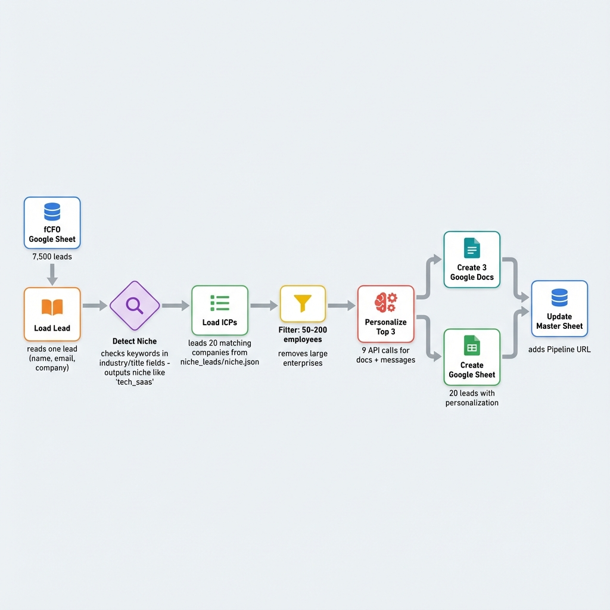

# Batch Asset Generation - System Workflow

## Visual Overview

---

## How Niche Detection Works

The system detects what industry/niche an fCFO serves by scanning keywords in their lead data:

### Fields Checked:
1. `Industry` - e.g., "Software/SaaS"
2. `Company Description` - e.g., "Provides CFO services to tech startups"
3. `Title` - e.g., "Fractional CFO for SaaS Companies"
4. `Headline` - LinkedIn headline
5. `Keywords` - Any keyword tags

### Niche Categories (9 total):

| Niche Key | Matched Keywords |
|-----------|-----------------|
| `tech_saas` | saas, software, technology, tech, startup, ai, cloud |
| `construction` | construction, building, contractor |
| `healthcare` | healthcare, medical, health, hospital, clinic |
| `real_estate` | real estate, property, realty, broker |
| `manufacturing` | manufacturing, factory, production, industrial |
| `hospitality` | restaurant, hotel, hospitality, food service |
| `retail_ecommerce` | retail, ecommerce, shop, store |
| `financial_services` | financial, finance, accounting, bank, investment |
| `insurance` | insurance, underwriting |

**Fallback**: If no keywords match → `professional_services`

---

## Step-by-Step Breakdown

### Step 1: Load fCFO Lead
Script reads one lead from the master Google Sheet containing 7,500+ fCFOs.

**Data pulled**: Name, Email, Company, Industry, Title, Headline

---

### Step 2: Detect Niche
Scans keywords in the lead's data to categorize them.

**Example**: 
- Title: "Fractional CFO for SaaS Companies"
- Match: `saas` keyword → `tech_saas` niche

---

### Step 3: Load Matching ICPs
Opens `niche_leads/tech_saas.json` and loads 20 companies.

**NEW: Company Size Filter** (50-200 employees)
- Removes enterprise companies (Webflow, Procore)
- Keeps mid-market companies fCFOs can confidently reach

---

### Step 4: Select Lead Magnet Template
Based on niche, picks the right report type:

| Niche | Lead Magnet |
|-------|------------|
| tech_saas | Investor Readiness Gap Analysis |
| retail | Inventory Cash Trap Analysis |
| healthcare | Burn Rate Survival Report |
| real_estate | Property Portfolio Profit Leak Finder |
| ...etc | ...17 templates total |

---

### Step 5: Personalize Top 3 ICPs
For each of the first 3 companies:

| Step | What Happens | API |
|------|-------------|-----|
| 5a | Generate connection message | GPT-4o-mini |
| 5b | Research company facts | Perplexity Sonar |
| 5c | Generate doc content | GPT-4o-mini |
| 5d | Create Google Doc | Google Docs API |

**Total: 9 AI calls + 3 docs per fCFO**

---

### Step 6: Create Google Sheet
Creates "[Name]'s 20 Leads" sheet with:
- Row 1-2: Pitch text + calendar CTA
- Row 3: Headers
- Rows 4-6: Top 3 ICPs (full contact + doc link)
- Rows 7-23: ICPs 4-20 ("Available upon request")

---

### Step 7: Update Master Sheet
Adds the generated sheet URL to the `Pipeline_Sheet_URL` column.

---

## Cost Analysis

| Resource | Per fCFO | For 500 fCFOs |
|----------|----------|---------------|
| OpenRouter (AI) | 9 calls | 4,500 calls (~$1.50) |
| Google Docs | 3 docs | 1,500 docs (free) |
| Google Sheets | 1 sheet | 500 sheets (free) |
| **Time** | ~2 min | ~15-17 hours |

---

## GDoc Formatting Standards

| Element | Style |
|---------|-------|
| H1 Headings | 20pt, Bold, Arial |
| H2 Headings | 16pt, Bold, Arial |
| H3 Headings | 13pt, Bold, Arial |
| Body Text | 11pt, Arial |
| Emojis | None (professional look) |
